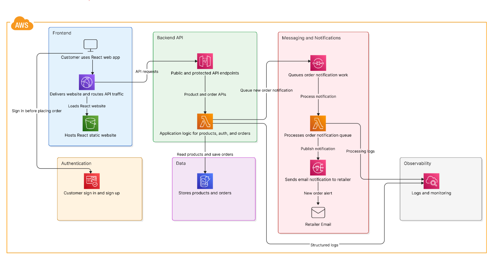

# Christmas Tree Store

A fully serverless ecommerce application for a seasonal Christmas tree retailer. Customers browse fresh-cut trees, create an account, and place pickup orders — all without a single always-on server.

---

## Table of Contents

1. [Approach](#1-approach)
2. [Architecture](#2-architecture)
3. [AWS Services](#3-aws-services)
4. [Authentication Flow](#4-authentication-flow)
5. [Order & Notification Workflow](#5-order--notification-workflow)
6. [AWS Deployment](#6-aws-deployment)
7. [API Reference](#7-api-reference)
8. [Data Models](#8-data-models)
9. [Security](#9-security)
10. [Logging & Observability](#10-logging--observability)
11. [Cost Estimates](#11-cost-estimates)
12. [Key Tradeoffs](#12-key-tradeoffs)
13. [AI Tools Used](#13-ai-tools-used)
14. [Future Improvements](#14-future-improvements)

---

## 1. Approach

### Problem
A local Christmas tree retailer needs an online storefront to take pre-orders for seasonal pickup. The site must cost almost nothing to run during the 10 off-season months, require zero operational overhead, and handle a sharp burst of traffic each November–December.

### Solution
A fully serverless AWS stack — no EC2, no containers, no databases to manage. Every component bills per request, scales to zero between seasons, and is defined as code (AWS SAM) so the entire environment is reproducible with a single command.

### Key engineering decisions
- **Lambda + API Gateway** over EC2/ECS — zero idle cost; scales automatically during peak season
- **Cognito auth via Lambda proxy** — although authentication was out of the original scope, Cognito was added to reliably identify the customer who placed each order (Cognito `sub` + verified email are stored with every order record); the proxy pattern also ensures the browser never calls AWS directly and the auth provider remains swappable
- **SQS → Lambda → SNS** for notifications — order creation is never blocked by email delivery failures
- **DynamoDB on-demand** — no capacity planning; pay-per-request scales to zero off-season
- **CloudFront in front of both S3 (SPA) and API Gateway** — single HTTPS domain, no CORS in production, global edge caching for static assets
- **arm64 / Graviton2** for all Lambdas — 20% cheaper per GB-second, zero code changes needed
- **No VPC** — DynamoDB, SQS, SNS, and Cognito are public AWS endpoints; a NAT Gateway would add ~$40/month for no benefit

---

## 2. Architecture



```
Browser
  │
  ▼
CloudFront Distribution (HTTPS)
  ├── Default (*): S3 Bucket (React SPA, static assets)
  │     └── Origin Access Control (OAC) — no public S3 access
  └── /api/*: API Gateway (Regional, REST)
        ├── Lambda — OrderApiFunction (Python 3.12, arm64)
        │     ├── GET  /api/health
        │     ├── GET  /api/products
        │     ├── GET  /api/products/{productId}  ──→ DynamoDB ProductsTable
        │     └── POST /api/orders [Cognito auth] ──→ DynamoDB OrdersTable
        │                                           ──→ SQS OrderQueue
        │                                                  └── Lambda — NotificationFunction
        │                                                        └── SNS → Email
        └── Lambda — AuthFunction (Python 3.12, arm64)
              ├── POST /api/auth/login    ─┐
              ├── POST /api/auth/register  │
              ├── POST /api/auth/confirm   ├─→ Cognito User Pool
              ├── POST /api/auth/refresh   │
              └── POST /api/auth/logout   ─┘

Cognito User Pool
  └── User Pool Client (ALLOW_USER_PASSWORD_AUTH + ALLOW_REFRESH_TOKEN_AUTH)
```

All 29 resources are defined in [`infra/template.yaml`](infra/template.yaml) and deployed as a single SAM/CloudFormation stack.

---

## 3. AWS Services

| Service | Role |
|---------|------|
| **CloudFront** | HTTPS CDN; unified domain for SPA and API; two origins (S3 + API Gateway) |
| **S3** | Hosts the React SPA bundle — public access fully blocked, served only via OAC |
| **API Gateway** | Regional REST API; Cognito JWT authorizer on `POST /orders`; CORS per-origin |
| **Lambda** | `OrderApiFunction` (catalog + orders) · `AuthFunction` (Cognito proxy) · `NotificationFunction` (SQS trigger) |
| **Cognito** | User Pool (email/password); issues JWTs validated by API Gateway |
| **DynamoDB** | `ProductsTable` (catalog) + `OrdersTable` (orders) — both on-demand billing |
| **SQS** | `OrderQueue` buffers order events; `OrderDLQ` captures messages that fail 3× |
| **SNS** | `OrderNotificationsTopic` delivers retailer email on every new order |
| **CloudWatch Logs** | Structured JSON logs from all three Lambdas |
| **X-Ray** | Distributed tracing enabled on all Lambdas (`Tracing: Active`) |
| **SAM / CloudFormation** | Infrastructure as Code — all 29 resources in one stack |

---

## 4. Authentication Flow

The frontend never calls Cognito directly — `AuthFunction` acts as a proxy:

```
1. POST /api/auth/register  { email, password }
      └── AuthFunction → Cognito SignUp → sends verification email

2. POST /api/auth/confirm   { email, code }
      └── AuthFunction → Cognito ConfirmSignUp

3. POST /api/auth/login     { email, password }
      └── AuthFunction → Cognito InitiateAuth (USER_PASSWORD_AUTH)
          ← { idToken, accessToken, refreshToken, expiresIn }

4. Tokens stored in sessionStorage (cleared on tab close)

5. POST /api/orders includes  Authorization: Bearer <idToken>
      └── API Gateway validates JWT against Cognito public JWKS
          Lambda receives only verified claims (sub, email)

6. Token refresh (60 s before expiry):
   POST /api/auth/refresh { refreshToken }
      └── AuthFunction → Cognito InitiateAuth (REFRESH_TOKEN_AUTH)

7. POST /api/auth/logout  Authorization: Bearer <accessToken>
      └── AuthFunction → Cognito GlobalSignOut (invalidates all sessions)
```

**Why a proxy?** The browser never needs to know Cognito exists. Swapping auth providers in future requires only backend changes.

---

## 5. Order & Notification Workflow

```
Customer submits order form
  └── POST /api/orders { productId, quantity, customerName, ... }
        └── OrderApiFunction:
              1. Validate Cognito claims from API Gateway context (401 if missing)
              2. Parse + validate request body
              3. Look up product in DynamoDB — uses server name, ignores client input
              4. PutItem → OrdersTable  { orderId, userId, status: PENDING, ... }
              5. SendMessage → SQS OrderQueue
              6. Return 201  { orderId, status: "PENDING", notificationStatus: "QUEUED" }

SQS OrderQueue (async, decoupled)
  └── NotificationFunction (per message):
        1. Parse order payload
        2. SNS.publish() → OrderNotificationsTopic → retailer email
        3. On failure: re-raise → SQS retries up to 3× → OrderDLQ
```

The order is committed to DynamoDB before the SQS message is sent. Notification failures never affect the customer's confirmation.

---

## 6. AWS Deployment

### Prerequisites

| Tool | Version |
|------|---------|
| AWS CLI | v2 |
| AWS SAM CLI | 1.120+ |
| Python | 3.12 |
| Node.js | 18+ |

### Step 1 — Clone

```bash
git clone <repo-url> christmas-tree-store && cd christmas-tree-store
```

### Step 2 — Configure AWS credentials

```bash
aws configure          # set region to us-east-1
aws sts get-caller-identity   # verify
```

### Step 3 — Build and deploy infrastructure

```bash
cd infra && sam build && sam deploy --guided
```

| Prompt | Value |
|--------|-------|
| Stack name | `christmas-tree-store` |
| Region | `us-east-1` |
| RetailerEmail | your email *(leave blank to skip SNS)* |
| CorsAllowedOrigin | `http://localhost:5173` *(updated in Step 7)* |
| Allow SAM to create IAM roles | `y` |
| Save config to samconfig.toml | `y` |

Capture the outputs after deploy:

```bash
aws cloudformation describe-stacks \
  --stack-name christmas-tree-store --region us-east-1 \
  --query "Stacks[0].Outputs" --output table
```

Key outputs: `CloudFrontUrl`, `UserPoolId`, `UserPoolClientId`, `FrontendBucketName`.

### Step 4 — Confirm SNS email subscription

Check your inbox for **"AWS Notification — Subscription Confirmation"** and click the link.

### Step 5 — Seed product catalog

```bash
cd ../backend
python3.12 -m venv .venv && .venv/bin/pip install -q -r requirements.txt

PRODUCTS_TABLE=christmas-tree-store-products \
AWS_DEFAULT_REGION=us-east-1 \
  .venv/bin/python -m src.seed.run
```

Verify: `aws dynamodb scan --table-name christmas-tree-store-products --region us-east-1 --query "Count" --no-cli-pager` → `5`

### Step 6 — Build and deploy the frontend

```bash
cd ../frontend

# Create production env file (replace values from Step 3 outputs)
cat > .env.production.local << EOF
VITE_API_URL=https://<CloudFrontUrl>
VITE_USER_POOL_ID=<UserPoolId>
VITE_USER_POOL_CLIENT_ID=<UserPoolClientId>
VITE_REGION=us-east-1
EOF

npm install && npm run build
aws s3 sync dist/ "s3://<FrontendBucketName>/" --delete
```

### Step 7 — Update CORS

```bash
cd ../infra
sam deploy --parameter-overrides "CorsAllowedOrigin=https://<CloudFrontUrl>"
```

### Step 8 — Invalidate CloudFront cache

```bash
aws cloudfront create-invalidation \
  --distribution-id <DistributionId> --paths "/*"
```

### Step 9 — Verify

```bash
CF=https://<CloudFrontUrl>
curl -s -o /dev/null -w "%{http_code}" "$CF/"      # 200
curl -s "$CF/api/health"                           # {"status":"ok",...}
curl -s "$CF/api/products" | python3 -m json.tool  # 5 products
```

### Teardown

```bash
aws s3 rm "s3://<FrontendBucketName>/" --recursive
sam delete --stack-name christmas-tree-store --region us-east-1
```

---

## 7. API Reference

All routes are prefixed `/api` via CloudFront.

| Method | Path | Auth | Description |
|--------|------|------|-------------|
| GET | `/api/health` | None | Service health check |
| GET | `/api/products` | None | List all products |
| GET | `/api/products/{productId}` | None | Get single product |
| POST | `/api/auth/register` | None | Create account |
| POST | `/api/auth/confirm` | None | Verify email code |
| POST | `/api/auth/login` | None | Sign in → tokens |
| POST | `/api/auth/refresh` | None | Refresh tokens |
| POST | `/api/auth/logout` | Bearer accessToken | Global sign-out |
| POST | `/api/orders` | Bearer idToken | Place an order |

**POST /api/orders body:**
```json
{
  "productId": "tree-001",
  "quantity": 1,
  "customerName": "Jane Smith",
  "customerEmail": "jane@example.com",
  "customerPhone": "555-123-4567",
  "preferredPickupDate": "2024-12-20",
  "notes": "Optional"
}
```

**201 response:** `{ "orderId", "status": "PENDING", "notificationStatus": "QUEUED" }`

---

## 8. Data Models

### ProductsTable (PK: `productId`)

| Attribute | Type | Notes |
|-----------|------|-------|
| `productId` | String (PK) | e.g. `tree-001` |
| `name`, `type`, `height` | String | |
| `price` | Number | USD |
| `description`, `careInstructions` | String | |
| `imageUrl` | String | Root-relative, e.g. `/trees/fraser_fir.png` |
| `availabilityStatus` | String | `AVAILABLE` \| `LOW_STOCK` \| `OUT_OF_STOCK` |
| `quantityAvailable` | Number | |
| `createdAt` / `updatedAt` | String | ISO 8601 |

### OrdersTable (PK: `orderId`)

| Attribute | Type | Notes |
|-----------|------|-------|
| `orderId` | String (PK) | UUID v4 |
| `userId` | String | Cognito `sub` |
| `userEmail` | String | From JWT claims |
| `productId` / `productName` | String | `productName` is a server-resolved snapshot |
| `quantity` | Number | |
| `customerName`, `customerEmail`, `customerPhone` | String | |
| `preferredPickupDate` | String | ISO date |
| `notes` | String | Optional |
| `status` | String | `PENDING` |
| `notificationStatus` | String | `QUEUED` |
| `createdAt` / `updatedAt` | String | ISO 8601 |

---

## 9. Security

| Control | Implementation |
|---------|---------------|
| **Auth proxy** | Browser never calls Cognito directly — no AWS SDK in the frontend bundle |
| **JWT validation** | API Gateway validates `idToken` against Cognito public JWKS on every `POST /orders` |
| **Token storage** | `sessionStorage` only — cleared on tab close |
| **Token refresh** | `AuthContext` auto-refreshes 60 s before expiry |
| **S3 access** | All 4 `BlockPublicAccess` flags set; OAC-only access |
| **CORS** | Explicit origin allowlist via `CorsAllowedOrigin` parameter — no `*` |
| **IAM** | Lambda roles scoped to specific table, queue, and topic ARNs — no wildcards |
| **Input validation** | Server-side: required fields, types, lengths, email/date format |
| **Product injection** | `productName` resolved server-side; client-supplied value ignored |
| **Log redaction** | Logger redacts `token`, `password`, `authorization`, `secret`, `credential` before CloudWatch |
| **SQS DLQ** | Failed messages retry 3× then land in `OrderDLQ` — no infinite loops |
| **Retry mode** | All boto3 clients use `Config(retries={"max_attempts": 3, "mode": "standard"})` |

---

## 10. Logging & Observability

All three Lambdas emit structured JSON to CloudWatch Logs:

```json
{
  "level": "INFO",
  "service": "order-api",
  "function": "christmas-tree-store-OrderApiFunction",
  "eventType": "create_order_complete",
  "order_id": "550e8400-...",
  "user_id": "abc123",
  "product_id": "tree-001"
}
```

Sensitive fields are redacted automatically. X-Ray active tracing is enabled on all Lambdas.

---

## 11. Cost Estimates

Seasonal store: ~500 orders in December, near-zero traffic the other 10 months.

| Service | Estimated Monthly Cost |
|---------|----------------------|
| Lambda (3 functions) | < $0.01 |
| DynamoDB on-demand | < $0.01 |
| API Gateway | < $0.01 |
| SQS + SNS | < $0.01 |
| CloudFront (~1 GB/month) | ~$0.09 |
| S3 | ~$0.01 |
| Cognito (≤ 50,000 MAU free tier) | $0.00 |
| **Total** | **< $0.15 / month** |

No VPC eliminates ~$32–$45/month in NAT Gateway charges.

---

## 12. Key Tradeoffs

| Decision | Why | What was accepted |
|----------|-----|-------------------|
| REST API Gateway over HTTP API v2 | Native Cognito authorizer — no custom Lambda authorizer needed | ~70% higher per-request cost (negligible at this scale) |
| Regional API Gateway | Cheaper for domestic traffic; CloudFront handles global edge for the SPA | No built-in multi-region failover |
| Single `OrderApiFunction` for all REST routes | One log group, one IAM role, one cold-start profile | All routes share a cold start |
| No VPC | Saves ~$40/month (NAT Gateway); no ENI cold-start penalty | No access to VPC-private resources (none needed) |
| DynamoDB on-demand | Scales to zero off-season; no capacity planning | Higher per-read cost than reserved provisioned (irrelevant at this scale) |
| Cognito auth proxy | Frontend is auth-provider-agnostic | One extra Lambda hop per auth call (~10–30 ms) |
| SQS → SNS decoupled notifications | Order creation never blocked by email failures | Retailer email is async (arrives within seconds) |
| arm64 / Graviton2 | 20% cheaper per GB-second | Cannot use x86-only native extensions (none needed) |
| `LOCAL_MOCK=true` test mode | 52 backend tests run with zero AWS credentials | Mock mode does not test actual DynamoDB queries |
| No inventory deduction | Avoids DynamoDB transaction complexity for an MVP | Overselling possible; stock managed manually |

---

## 13. AI Tools Used

System architecture, technology selections, and all engineering requirements were defined by me after thorough independent research using **ChatGPT Deep Research** mode. All architectural decisions and trade-off analysis reflect my own analysis and intent.

**GitHub Copilot (Claude Sonnet)** was used within VS Code for implementation assistance:

| Task | AI involvement |
|------|---------------|
| SAM template scaffolding | Generated initial structure; reviewed and corrected by me |
| Python Lambda handlers | Generated boilerplate; auth proxy pattern and retry config designed by me |
| React components and pages | Generated structure; auth context and token refresh logic designed by me |
| Test cases (pytest + Vitest) | Generated initial tests; edge cases added by me |
| Security controls | Suggested OAC, CORS config, log redaction; validated by me |
| Documentation | Drafted; all technical content verified against the actual implementation |

Issues caught and corrected during review: `DefaultAuthorizer: NONE` SAM bug; logger `capsys` compatibility in pytest; Vite/Node version mismatches; missing `_BOTO_CONFIG` and `ClientError` imports in the order handler.

---

## 14. Future Improvements

- **Inventory management** — Atomic `UpdateItem` with `ConditionExpression` to prevent overselling
- **Order status transitions** — `CONFIRMED → READY → PICKED_UP` with a PATCH endpoint
- **Payment** — Stripe Checkout before `POST /orders`; idempotent order creation
- **CI/CD** — GitHub Actions: lint + test → `sam build` → `sam deploy` → `aws s3 sync`
- **Monitoring** — CloudWatch alarms on Lambda error rate, DLQ depth, API 4xx/5xx
- **Admin UI** — Separate Cognito group, protected React route, product/order management
- **MFA** — TOTP or SMS via the Cognito auth proxy
- **Rate limiting** — API Gateway usage plan or WAF rule on `/api/auth/*`
- **End-to-end tests** — Playwright suite against a deployed staging stack
- **Custom domain** — Register a domain in Route 53 (or any DNS registrar), issue a public certificate via ACM, then attach the certificate to both CloudFront and API Gateway as a custom domain name so the store is reachable at e.g. `www.christmastreestore.com` instead of the auto-generated CloudFront URL
